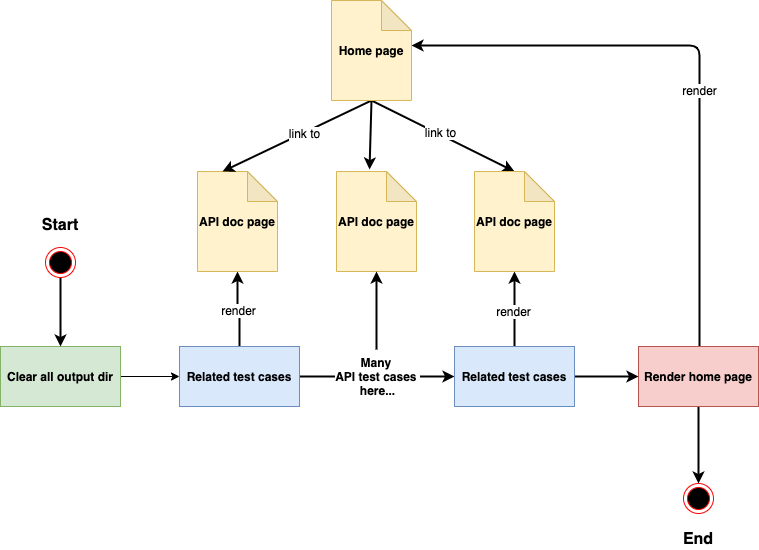

# node-autodoc

[](https://coveralls.io/github/Haixiang6123/node-autodoc?branch=main)
[](https://www.travis-ci.com/Haixiang6123/node-autodoc)

[English](./README-CN.md)

一个测试驱动文档的生成器。灵感来源于 [autodoc](https://github.com/r7kamura/autodoc) 和 [supertest](https://www.npmjs.com/package/supertest).

## 为什么需要它

对于大项目来说，很多人不喜欢维护 API 文档。新人接手的时候对着老接口就容易蒙逼，导致很多无效沟通。

这个库可以在写简单接口测试用例时，直接根据测试用例，生成 API 文档。

## 工作流



## 样例

这个 repo 里也提供一个样例给大家食用，可以看 [这里](https://github.com/Haixiang6123/node-autodoc/tree/main/example)

## 渲染方式

### 默认渲染

默认会使用 ejs 的模板引擎再结合默认模板来渲染 API 文档。

### 自定义模板

如果你想用自己的模板，更改 `templateDir` 指向你的模板文件夹即可。
可以先参考 [默认模板](https://github.com/Haixiang6123/node-autodoc/tree/main/lib/templates) ，再制作你的模板。

### 自定义渲染函数

**如果你有更好的渲染方法，你也可以一个函数进 `renderPage` 里，来实现自定义渲染。**

```js
agent.renderPage((currentAgent) => {
  // Assemable your render data
  const myRenderData = {
    title: currentAgent.title,
    description: currentAgent.description,
    docMetaCollection: currentAgent.docMetaCollection,
    tableOfContent: currentAgent.docMetaCollection.map((docMeta) => ({
      link: `#${encodeURIComponent(docMeta.title)}`,
      title: docMeta.title,
    })),
  };
  
  // Your render function
  customRender(myRenderData);
})
```

**一个非常实用的操作是，将 `docMetaCollection` 发到自己的文档服务器上，再用这些数据生成文档网站。**

## API

很多使用方法都和 [supertest](https://www.npmjs.com/package/supertest) 很像。API 也很简单。

新增的 API 如下。

### AutoDocAgent

```js
const agent = new AutoDocAgent(
  app,
  {
    outputFilename: 'users.html',
    title: 'Users API Documentation',
    description: 'A small and simple documentation for how to deal with /users api',
    outputDir,
    templateDir,
  }
)
```

#### AutoDocAgent

| 参数 | 描述 |
|---|---|
| app | Express 或者 KOA 应用 |
| options | supertest Agent 的 options |


#### options

| 参数 | 描述 |
|---|---|
| outputFilename | 输出的 html 文件名 |
| outputDir | 输出路径 |
| templateDir | ejs 模板路径，不传值时默认使用 [默认模板](https://github.com/Haixiang6123/node-autodoc/tree/main/lib/templates)|
| title | API 文档标题 |
| description | API 文档描述 |

### AutoDocAgent.clear

清除 `outputDir` 路径下的内容.

```js
AutoDocAgent.clear(outputDir)
```

### AutoDocAgent.renderIndex

给定 agents 列表渲染首页。

```js
AutoDocAgent.renderIndex({
  title: 'My API Documentation',
  description: 'This is my first documentation for testing, haha~',
  author: 'Haixiang',
  agents,
  outputDir,
  templateDir,
});
```

| parameter | value |
|---|---|
| title | 首页标题 |
| description | 首页描述 |
| author | 作者名 |
| agents | agents 列表 |
| outputDir | 输出路径 |
| templateDir | 模板路径. 不传值时使用[默认模板](https://github.com/Haixiang6123/node-autodoc/tree/main/lib/templates) |

### restful 方法

当调用 restful 方法时，其实是调用了 supertest 提供的 restful 方法。不同地方在于要多加第 2 个参数用于描述此次操作。

```js
agent.get('/users', {
  title: 'Fetch all users',
  description: 'To get all user infomation'
})
```

### renderPage

渲染当前页面

```js
agent.renderPage()
```

**一个非常实用的操作是，将 `docMetaCollection` 发到自己的文档服务器上，再用这些数据生成文档网站。**

```js
agent.renderPage((currentAgent) => {
  // Assemable your render data
  const myRenderData = {
    title: currentAgent.title,
    description: currentAgent.description,
    docMetaCollection: currentAgent.docMetaCollection,
    tableOfContent: currentAgent.docMetaCollection.map((docMeta) => ({
      link: `#${encodeURIComponent(docMeta.title)}`,
      title: docMeta.title,
    })),
  };
  
  // Your render function
  customRender(myRenderData);
})
```
