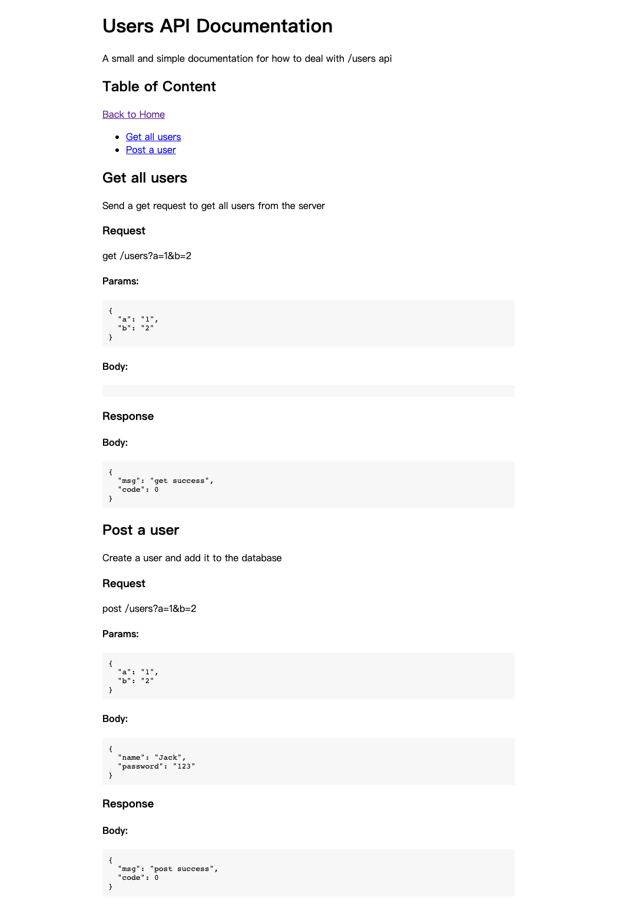

# AutoDoc example

## API documentation preview

Check [this](http://yanhaixiang.com/node-autodoc/) out.

## Structure

Here's the example structure:

```
├── app.js          // express web app
├── autodoc         // documenation output directory
├── bin             // start entry
├── jest.config.js  // config, add the setup.js and tearndown.js to here
├── public
├── routes          // all your apis
│   ├── books.js
│   ├── index.js
│   └── users.js
├── test
│   ├── setup.js    // clear the /autodoc directory first
│   ├── unit        // unit test cases, each one will render an api doc page
│   ├── utils       // some useful constants here
│   └── teardown.js // render home page
└── yarn.lock
```

## How to use

Let's say we have an express web app:

```js
// app.js
const app = express();

app.get('/users', (req, res) => {
  res.send({ msg: 'get success', code: 0 });
});

app.post('/users', (req, res) => {
  res.json({ msg: 'post success', code: 0 });
});

app.get('/books', (req, res) => {
  res.send({ msg: 'get success', code: 0 });
});

app.post('/books', (req, res) => {
  res.json({ msg: 'post success', code: 0 });
});
```

Then, prepare your http request agent, just like how the "supertest" package does:

```js
// constants.js
import AutoDocAgent from 'node-autodoc';

// API documentation output dir 
const outputDir = path.join(__dirname, './templates');
// ejs templates dir
const templateDir = path.join(__dirname, './autodoc');

// Make a smart agent just like how the "supertest" package does
const usersAgent = new AutoDocAgent(app, {
  outputFilename: 'users.html',
  title: 'Users API Documentation',
  description: 'A small and simple documentation for how to deal with /users api',
  outputDir,
  templateDir,
});
```

Then, write a simple test case to test your API and generate an API documentation page:

```js
// users.test.js
describe('test /users API', () => {
  // A simple test case
  it('should get all the users', (done) => {
    usersAgent
      .get('/users?a=1&b=2', { title: 'Get all users', description: 'Send a get request to get all users from the server' })
      .end((err) => {
        // Some assertion here...
        done();
      });
  });

  // Render curent documenation page to the given 'outputDir'
  afterAll(() => booksAgent.renderPage());
})
```

The API doc page would be like this:



In the end, call the `AutoDocAgent.renderIndex()` in the `teardown.js` file to render the home page.

```js
// teardown.js
import AutoDocAgent from 'node-autodoc';
import {
  outputDir, templateDir, usersAgent, booksAgent,
} from './utils/constants';

const agents = [booksAgent, usersAgent];

module.exports = async () => {
  AutoDocAgent.renderIndex({
    title: 'My API Documentation',
    description: 'This is my first documentation for testing, haha~',
    author: 'Haixiang',
    agents,
    outputDir,
    templateDir,
  });
};
```

The home page would be like this:


